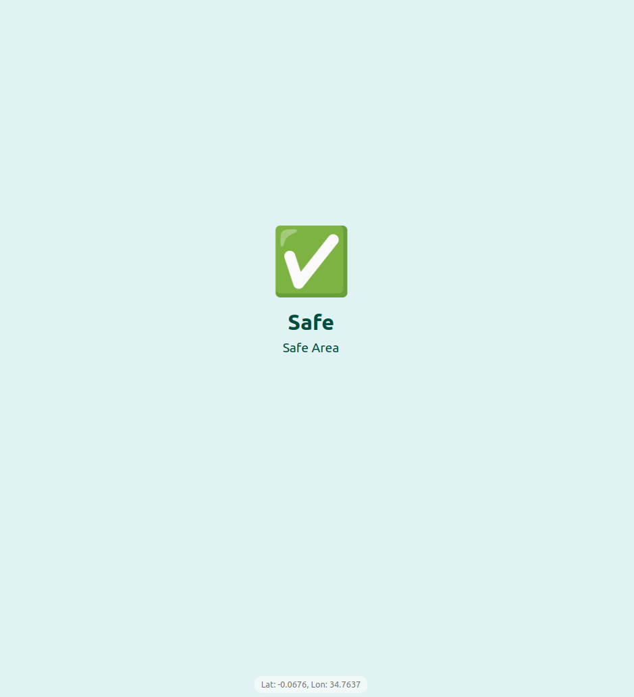

## Project: "Keep Safe" - A Real-Time Geolocation Safety Alert Demo

"Keep Safe" is a functional prototype demonstrating a modern safety application for personal and road use. The primary goal is to provide immediate, intuitive alerts to users, warning them as they approach areas with known risks.

- This demo simulates a mobile experience in the browser, using a React frontend to capture live location data and a Node.js/Express backend to serve as the "safety intelligence" hub. The backend maintains a list of geofenced danger zones (defined by coordinates and a radius). When the frontend sends the user's current coordinates, the backend calculates their proximity to these zones.

The user interface is designed for clarity and immediacy:

    - Green/Safe: Default state, indicating no immediate threats.

    - Amber/Warning: The screen turns amber to warn drivers of an upcoming accident black      spot, prompting extra caution.

     -Red/Danger: The screen turns red to alert an individual that they are entering a high-crime or otherwise dangerous area.

## How to Run the Project
Prerequisites

- Node.js (version 14 or higher)

- npm (usually comes with Node.js)

## Step 1: Clone & Install

First, clone the repository and install all dependencies for both the backend and frontend.
Generated bash

      
# Clone the repository (if you have it on Git)
git clone https://github.com/Brace1000/keep-safe.git
cd keep-safe

## Step 2: Start the Backend Server

In your first terminal, navigate to the backend directory and start the Node.js server.
Generated bash

      
cd backend
node server.js

You should see the following message, indicating the server is running:

    Keep Safe backend server running on http://localhost:3001

Leave this terminal running.
## Step 3: Start the Frontend Application

Open a second, separate terminal. Navigate to the frontend directory and start the Vite development server.
Generated bash

      
cd frontend
npm run dev

    

## Step 4: View and Test the App

Open your web browser and navigate to the frontend URL (http://localhost:5173).

    The browser will ask for permission to access your location. You must click "Allow" for the app to function.

    The application will start in "Safe Mode."

## Testing the Unsafe Zones

To test the alerts, you need to simulate your location using your browser's developer tools.

For Google Chrome / Edge:

    Press F12 to open Developer Tools.

    Click the three-dot menu (...) > More tools > Sensors.

    In the Location dropdown, select "Other...".

    Enter one of the following coordinates:

        Danger Zone (Red): Latitude: 34.0522, Longitude: -118.2437

        Warning Zone (Amber): Latitude: 37.8199, Longitude: -122.4783

    The app's UI will update instantly.

    
